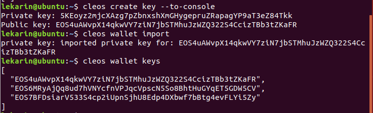
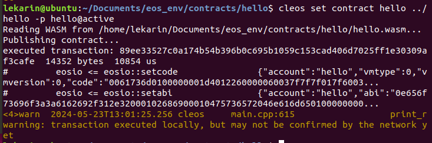

# EOS区块链开发

https://developers.eos.io/

第1步至第15步是在Ubuntu 18.04上部署EOS区块链、创建钱包、用户以及部署测试合约hello的全过程，第16步是在网上搜到的多主机部署区块链网络的教程，第17步是咱们的EOS可信存证系统的智能合约代码

## 1、安装依赖库

安装EOS需要的依赖库，这里以Ubuntu 18.04为例

```bash
wget https://github.com/eosio/eos/releases/download/v2.1.0/eosio_2.1.0-1-ubuntu-18.04_amd64.deb
sudo apt install ./eosio_2.1.0-1-ubuntu-18.04_amd64.deb
```

创建合约文件夹

```bash
mkdir contracts
cd contracts
```

获得合约的绝对地址

```bash
pwd
```

## 2、安装EOSIO.CDT

```bash
wget https://github.com/eosio/eosio.cdt/releases/download/v1.8.0/eosio.cdt_1.8.0-1-ubuntu-18.04_amd64.deb

sudo apt install ./eosio.cdt_1.8.0-1-ubuntu-18.04_amd64.deb
```

## 3、创建eosio钱包

```bash
cleos wallet create --to-console
```


内容显示如下：

```bash
"/usr/opt/eosio/2.1.0/bin/keosd" launched
Creating wallet: default
Save password to use in the future to unlock this wallet.
Without password imported keys will not be retrievable.
"PW5KY9mEN8UFeStUXF9axZ8t1cJFxSTCq95n7qRs2CFz9ZmHxWz4i" # 创建钱包后，这个位置的这个密钥就是解锁密钥
```

在初始状态下，钱包是`close`状态，可以通过以下命令启动

```bash
cleos wallet open
```

之后，输入以下命令可以查看钱包列表

```
cleos wallet list
```

它会返回

```bash
Wallets:
[
  "default"
]
```

## 4、解锁eosio钱包

```
cleos wallet unlock
```

之后会提醒你输入密钥，在前面的创建步骤中就有

解锁成功后，再次输入`cleos wallet list`指令，就可以得到以下内容

```
Wallets:
[
  "default *"
]
```

`*`表示该钱包已解锁


## 5、导入Development Key

每一个新的EOSIO链都有一个名为eosio的系统用户，每个新的 EOSIO 链都有一个Development Key，这个密钥是相同的。加载此密钥可代表系统用户（eosio）签署交易

Development Key内容如下：

```
5KQwrPbwdL6PhXujxW37FSSQZ1JiwsST4cqQzDeyXtP79zkvFD3
```

```
cleos wallet import
```

显示以下内容（导入私钥，返回公钥值）

```
private key: imported private key for: EOS6MRyAjQq8ud7hVNYcfnVPJqcVpscN5So8BhtHuGYqET5GDW5CV
```

输入以下命令可以查看密钥

```
cleos wallet keys
```


第一行就是Development Key，第二行是之后步骤导入的其它公钥

## 6、识别三个可执行文件

cleos-管理账户、查询链信息、部署合约与交互的客户端工具

nodeos-负责整体链管理的命令工具，比如启动/停止

keosd-钱包管理工具

## 7、启动keosd

```bash
keosd &
```

如果遇到了以下问题，就先输入`pkill keosd`后再运行以上命令即可


## 8、启动nodeos

```
nodeos -e -p eosio --plugin eosio::producer_plugin --plugin eosio::producer_api_plugin --plugin eosio::chain_api_plugin --plugin eosio::http_plugin --plugin eosio::history_plugin --plugin eosio::history_api_plugin --filter-on="*" --access-control-allow-origin='*' --contracts-console --http-validate-host=false --verbose-http-errors >> nodeos.log 2>&1 &
```

这些设置会完成以下任务：

运行 Nodeos。该命令加载所有基本插件、设置服务器地址、启用 CORS 并添加一些合同调试和日志记录。
启用无限制 CORS (*) 和开发日志记录

可能会遇到以下问题（按下enter键以后直接弹出Exit了，原因是这个区块链没有正常启动）


可以在终端运行的位置找到`nodeos.log`文件，里面会出现以下内容：


那就在后面加上`--replay-blockchain`和`--hard-replay-blockchain`

```
nodeos -e -p eosio --plugin eosio::producer_plugin --plugin eosio::producer_api_plugin --plugin eosio::chain_api_plugin --plugin eosio::http_plugin --plugin eosio::history_plugin --plugin eosio::history_api_plugin --filter-on="*" --access-control-allow-origin='*' --contracts-console --http-validate-host=false --verbose-http-errors --replay-blockchain --hard-replay-blockchain >> nodeos.log 2>&1 &
```

注意：数据和配置文件放在`~/.local/share/eosio/nodeos/config`文件夹中


## 9、验证区块链正常启动

### 检查Nodeos endpoints

可以检查RPC API是否正常工作

在浏览器中，输入：

```
http://localhost:8888/v1/chain/get_info
```

看到以下内容，说明正确工作了：


## 10、创建测试钱包

与上面的eosio钱包不同，这是其它的钱包

```
cleos wallet create -n test --to-console
```

```
Creating wallet: test
Save password to use in the future to unlock this wallet.
Without password imported keys will not be retrievable.
"PW5JYyBJhT4KfoVakbZzrg425ZvrCixhMy7WLMw7BmWNNBETgB83t"
```

## 11、解锁测试钱包

```
cleos wallet unlock -n test
```

## 12、生成公私钥对

```
cleos create key --to-console
```

```bash
lekarin@ubuntu:~$ cleos create key --to-console
Private key: 5KEoyz2mjcXAzg7pZbnxshXmGHygepruZRapagYP9aT3eZ84Tkk
Public key: EOS4uAWvpX14qkwVY7ziN7jbSTMhuJzWZQ322S4CcizTBb3tZKaFR
```


注意这个公私钥要与解锁钱包的区分开，这个公私钥用于钱包创建于用户！（一个公钥对应一个用户地址）

## 13、私钥导入钱包

### 导入测试钱包

```
cleos wallet import --name test --private-key
```


后面显示的就是公钥

至此，我们得到的钱包相关内容：

```
test钱包
钱包密钥：PW5JYyBJhT4KfoVakbZzrg425ZvrCixhMy7WLMw7BmWNNBETgB83t
公钥：EOS63PsDzSKXrwo8pJwdqBmAxhh953JyHm4R22cguVUGxd69ftTSw
私钥：5KNeE5Don6F6Ez7gbDnfdnTHnBnoVgwKyEw1erQELcG1j9n5YbL
```

查看钱包的密钥

```bash
cleos wallet keys
```

注意，每一个钱包公钥对应一个用户！

### 导入eosio钱包

```
cleos wallet import 
然后输入第12步中生成的私钥
```



## 14、创建用户

这里输入的`钱包公钥`是第12步生成的公钥（需要导入钱包才能使用）

```
cleos create account eosio 用户名 钱包公钥（作为用户地址）
```

例如：

```bash
cleos create account eosio alice EOS7BFDsiarV533S4cp2iUpnSjhU8Edp4DXbwf7bBtg4evFLYi5Zy
```

这里注册的是`bob`用户，位于eosio钱包中


注意，创建用户需要开启eosio

查看用户信息

```bash
cleos get account -j 用户名
```

```bash
lekarin@ubuntu:~$ cleos get account -j alice
{
  "account_name": "alice",
  "head_block_num": 5077,
  "head_block_time": "2024-05-23T12:49:25.000",
  "privileged": false,
  "last_code_update": "1970-01-01T00:00:00.000",
  "created": "2024-05-19T06:12:31.000",
  "ram_quota": -1,
  "net_weight": -1,
  "cpu_weight": -1,
  "net_limit": {
    "used": -1,
    "available": -1,
    "max": -1,
    "last_usage_update_time": "2024-05-19T06:12:31.000",
    "current_used": -1
  },
  "cpu_limit": {
    "used": -1,
    "available": -1,
    "max": -1,
    "last_usage_update_time": "2024-05-19T06:12:31.000",
    "current_used": -1
  },
  "ram_usage": 2724,
  "permissions": [{
      "perm_name": "active",
      "parent": "owner",
      "required_auth": {
        "threshold": 1,
        "keys": [{
            "key": "EOS7BFDsiarV533S4cp2iUpnSjhU8Edp4DXbwf7bBtg4evFLYi5Zy",
            "weight": 1
          }
        ],
        "accounts": [],
        "waits": []
      }
    },{
      "perm_name": "owner",
      "parent": "",
      "required_auth": {
        "threshold": 1,
        "keys": [{
            "key": "EOS7BFDsiarV533S4cp2iUpnSjhU8Edp4DXbwf7bBtg4evFLYi5Zy",
            "weight": 1
          }
        ],
        "accounts": [],
        "waits": []
      }
    }
  ],
  "total_resources": null,
  "self_delegated_bandwidth": null,
  "refund_request": null,
  "voter_info": null,
  "rex_info": null
}

```

## 15、部署测试合约Hello

### 创建hello用户

创建公私钥对

```
cleos create key --to-console
Private key: 5KhHGmQLNx5YYF5SWCavGovN1RWaTDyhmdsmZTiRepdTaxgEih3
Public key: EOS5nfrCmfVMUckWFUj2hMczoK11RUyosjTk6DrtQmttuAUPpmaRn
```

导入公私钥

```
cleos wallet import
private key: imported private key for: EOS5nfrCmfVMUckWFUj2hMczoK11RUyosjTk6DrtQmttuAUPpmaRn
```

用公钥创建hello用户

```
cleos create account eosio hello EOS5nfrCmfVMUckWFUj2hMczoK11RUyosjTk6DrtQmttuAUPpmaRn
```


在`contracts`文件夹下，创建一个新的文件夹`hello`，新建文件`hello.cpp`

```
touch hello.cpp
```

```c++
#include <eosio/eosio.hpp>
class [[eosio::contract]] hello : public eosio::contract {
  public:
      using eosio::contract::contract;
      [[eosio::action]] void hi( eosio::name user ) {
         print( "Hello, ", user);
      }
};
```

### 编译

```bash
eosio-cpp -abigen -o hello.wasm hello.cpp
```


### 部署

```bash
cleos set contract hello ../hello -p hello@active
```



### 调用hello合约中的hi函数

```bash
cleos push action hello hi '["alice"]' -p alice@active
```


## 16、多主机测试网（六年前的博客，试试看能不能用）

https://blog.csdn.net/weixin_39842528/article/details/81034018

使用四台同主段主机，第一台作为eosio创世用户，其它三台作为出块节点

eosio 10.186.11.211

user2 10.186.11.223

user3 10.186.11.220

user4 10.186.11.141

### 修改eosio节点配置文件

四台主机都先运行nodeos和keosd，生成配置文件

```ini
bnet-endpoint = 10.186.11.211:4321    

//for communicatin with cleos
http-server-address = 10.186.11.211:8888  
  
//for sync block
p2p-listen-endpoint = 10.186.11.211:9876 
p2p-peer-address = 10.186.11.223:9876
p2p-peer-address = 10.186.11.220:9876
p2p-peer-address = 10.186.11.141:9876 

agent-name = "EOS Test Agent"

//if eosio, this flag must be true, else must be set false, it decide whether or not 
//product block
enable-stale-production = true

//producer name
producer-name = eosio

//producer key,get by use"cleos ceate key"
private-key =["EOS8Znrtgwt8TfpmbVpTKvA2oB8Nqey625CLN8bCN3TEbgx86Dsvr", "5K463ynhZoCDDa4RDcr63cUwWLTnKqmdcoTKTHBjqoKfv4u5V7p"]

unlock-timeout = 90000

//load plugin
plugin = eosio::chain_api_plugin
plugin = eosio::history_api_plugin
plugin = eosio::chain_plugin
plugin = eosio::history_plugin
plugin = eosio::net_plugin
plugin = eosio::net_api_plugin 
```

### 创建并导入密钥

这里，需要创建九个系统用户，三个普通用户（只是用于投票）

user2 10.186.11.223

user3 10.186.11.220

user4 10.186.11.141

usera

userb

userc

```
//eosio key 
EOS8Znrtgwt8TfpmbVpTKvA2oB8Nqey625CLN8bCN3TEbgx86Dsvr
5K463ynhZoCDDa4RDcr63cUwWLTnKqmdcoTKTHBjqoKfv4u5V7p

//producers
//user2
5KLGj1HGRWbk5xNmoKfrcrQHXvcVJBPdAckoiJgFftXSJjLPp7b
EOS8imf2TDq6FKtLZ8mvXPWcd6EF2rQwo8zKdLNzsbU9EiMSt9Lwz

//user3
5K6qk1KaCYYWX86UhAfUsbMwhGPUqrqHrZEQDjs9ekP5j6LgHUu
EOS7Ef4kuyTbXbtSPP5Bgethvo6pbitpuEz2RMWhXb8LXxEgcR7MC

//user4
5JCStvbRgUZ6hjyfUiUaxt5iU3HP6zC1kwx3W7SweaEGvs4EPfQ
EOS5n442Qz4yVc4LbdPCDnxNSseAiUCrNjRxAfPhUvM8tWS5svid6

//users
//usera
5JtUScZK2XEp3g9gh7F8bwtPTRAkASmNrrftmx4AxDKD5K4zDnr
EOS69X3383RzBZj41k73CSjUNXM5MYGpnDxyPnWUKPEtYQmTBWz4D

//userb
5JUNYmkJ5wVmtVY8x9A1KKzYe9UWLZ4Fq1hzGZxfwfzJB8jkw6u
EOS7yBtksm8Kkg85r4in4uCbfN77uRwe82apM8jjbhFVDgEgz3w8S

//userc
5K6LU8aVpBq9vJsnpCvaHCcyYwzPPKXfDdyefYyAMMs3Qy42fUr
EOS7WnhaKwHpbSidYuh2DF1qAExTRUtPEdZCaZqt75cKcixuQUtdA
```

创建default钱包

```bash
cleos --wallet-url http://127.0.0.1:8900 --url http://10.186.11.211:8888 wallet create
PW5JkUedyEiWWK1tz4oFcoqRnn2iR9W5U9RhaLyswajLLLJ1xy7sp
```

导入其它用户的密钥对

```bash
cleos --wallet-url http://127.0.0.1:8900 --url http://10.186.11.211:8888 wallet import 5K6qk1KaCYYWX86UhAfUsbMwhGPUqrqHrZEQDjs9ekP5j6LgHUu
cleos --wallet-url http://127.0.0.1:8900 --url http://10.186.11.211:8888 wallet import 5JCStvbRgUZ6hjyfUiUaxt5iU3HP6zC1kwx3W7SweaEGvs4EPfQ
cleos --wallet-url http://127.0.0.1:8900 --url http://10.186.11.211:8888 wallet import 5JtUScZK2XEp3g9gh7F8bwtPTRAkASmNrrftmx4AxDKD5K4zDnr
cleos --wallet-url http://127.0.0.1:8900 --url http://10.186.11.211:8888 wallet import 5JUNYmkJ5wVmtVY8x9A1KKzYe9UWLZ4Fq1hzGZxfwfzJB8jkw6u
cleos --wallet-url http://127.0.0.1:8900 --url http://10.186.11.211:8888 wallet import 5K6LU8aVpBq9vJsnpCvaHCcyYwzPPKXfDdyefYyAMMs3Qy42fUr
cleos --wallet-url http://127.0.0.1:8900 --url http://10.186.11.211:8888 wallet import 5KQwrPbwdL6PhXujxW37FSSQZ1JiwsST4cqQzDeyXtP79zkvFD3
```

还有两个特殊密钥

```bash
cleos --wallet-url http://127.0.0.1:8900 --url http://10.186.11.211:8888 wallet import 5KQwrPbwdL6PhXujxW37FSSQZ1JiwsST4cqQzDeyXtP79zkvFD3
cleos --wallet-url http://127.0.0.1:8900 --url http://10.186.11.211:8888 wallet import 5K463ynhZoCDDa4RDcr63cUwWLTnKqmdcoTKTHBjqoKfv4u5V7p
```

#### 创建九个系统用户

九个系统用户共享eosio开发者密钥

eosio.bpay:矿工获取出块奖励的临时代管账户，增发EOS的1%的25%会先转到这个账户;

eosio.msig:多重签名管理的账户;

eosio.names:靓号账户拍卖管理的账户;

eosio.ram:内存买卖管理的账户;

eosio.ramfee:内存买卖收取手续费的账户，按照每笔交易千分之5的费率收取手续费;

eosio.saving:增发EOS临时存放账户，增发总量 5%，其中80%放在此账户，另外 20%再分成25%和75%，分别给eosio.bpay和eosio.vpay;

eosio.stake:管理EOS抵押的账户;

eosio.token:发行和管理token的账户;

eosio.vpay:矿工按照获得投票多少比例获取奖励的临时代管账户，增发EOS的1%的75%会先转到这个账户.

```
cleos --wallet-url http://127.0.0.1:8900 --url http://10.186.11.211:8888 create account eosio eosio.bpay EOS8Znrtgwt8TfpmbVpTKvA2oB8Nqey625CLN8bCN3TEbgx86Dsvr
cleos --wallet-url http://127.0.0.1:8900 --url http://10.186.11.211:8888 create account eosio eosio.msig EOS8Znrtgwt8TfpmbVpTKvA2oB8Nqey625CLN8bCN3TEbgx86Dsvr
cleos --wallet-url http://127.0.0.1:8900 --url http://10.186.11.211:8888 create account eosio eosio.names EOS8Znrtgwt8TfpmbVpTKvA2oB8Nqey625CLN8bCN3TEbgx86Dsvr
cleos --wallet-url http://127.0.0.1:8900 --url http://10.186.11.211:8888 create account eosio eosio.ram EOS8Znrtgwt8TfpmbVpTKvA2oB8Nqey625CLN8bCN3TEbgx86Dsvr
cleos --wallet-url http://127.0.0.1:8900 --url http://10.186.11.211:8888 create account eosio eosio.ramfee EOS8Znrtgwt8TfpmbVpTKvA2oB8Nqey625CLN8bCN3TEbgx86Dsvr
cleos --wallet-url http://127.0.0.1:8900 --url http://10.186.11.211:8888 create account eosio eosio.saving EOS8Znrtgwt8TfpmbVpTKvA2oB8Nqey625CLN8bCN3TEbgx86Dsvr
cleos --wallet-url http://127.0.0.1:8900 --url http://10.186.11.211:8888 create account eosio eosio.stake EOS8Znrtgwt8TfpmbVpTKvA2oB8Nqey625CLN8bCN3TEbgx86Dsvr
cleos --wallet-url http://127.0.0.1:8900 --url http://10.186.11.211:8888 create account eosio eosio.token EOS8Znrtgwt8TfpmbVpTKvA2oB8Nqey625CLN8bCN3TEbgx86Dsvr
cleos --wallet-url http://127.0.0.1:8900 --url http://10.186.11.211:8888 create account eosio eosio.vpay EOS8Znrtgwt8TfpmbVpTKvA2oB8Nqey625CLN8bCN3TEbgx86Dsvr
```

### 创建节点用户与普通用户

```bash
//create and transfer to producer
cleos --wallet-url http://127.0.0.1:8900 --url http://10.186.11.211:8888 system newaccount --transfer eosio lwz EOS8imf2TDq6FKtLZ8mvXPWcd6EF2rQwo8zKdLNzsbU9EiMSt9Lwz --stake-net "100000000.0000 SYS" --stake-cpu "100000000.0000 SYS" --buy-ram "20000.0000 SYS"   
cleos --wallet-url http://127.0.0.1:8900 --url http://10.186.11.211:8888 transfer eosio lwz "20000.0000 SYS"

cleos --wallet-url http://127.0.0.1:8900 --url http://10.186.11.211:8888 system newaccount --transfer eosio hml EOS7Ef4kuyTbXbtSPP5Bgethvo6pbitpuEz2RMWhXb8LXxEgcR7MC --stake-net "100000000.0000 SYS" --stake-cpu "100000000.0000 SYS" --buy-ram "20000.0000 SYS"   
cleos --wallet-url http://127.0.0.1:8900 --url http://10.186.11.211:8888 transfer eosio hml "20000.0000 SYS"

cleos --wallet-url http://127.0.0.1:8900 --url http://10.186.11.211:8888 system newaccount --transfer eosio lx EOS5n442Qz4yVc4LbdPCDnxNSseAiUCrNjRxAfPhUvM8tWS5svid6 --stake-net "100000000.0000 SYS" --stake-cpu "100000000.0000 SYS" --buy-ram "20000.0000 SYS"   
cleos --wallet-url http://127.0.0.1:8900 --url http://10.186.11.211:8888 transfer eosio lx "20000.0000 SYS"

//create and transfer to user
cleos --wallet-url http://127.0.0.1:8900 --url http://10.186.11.211:8888 system newaccount --transfer eosio usera EOS69X3383RzBZj41k73CSjUNXM5MYGpnDxyPnWUKPEtYQmTBWz4D --stake-net "50000000.0000 SYS" --stake-cpu "50000000.0000 SYS" --buy-ram "20000.0000 SYS"   
cleos --wallet-url http://127.0.0.1:8900 --url http://10.186.11.211:8888 transfer eosio usera "20000.0000 SYS"

cleos --wallet-url http://127.0.0.1:8900 --url http://10.186.11.211:8888 system newaccount --transfer eosio userb EOS7yBtksm8Kkg85r4in4uCbfN77uRwe82apM8jjbhFVDgEgz3w8S --stake-net "50000000.0000 SYS" --stake-cpu "50000000.0000 SYS" --buy-ram "20000.0000 SYS"   
cleos --wallet-url http://127.0.0.1:8900 --url http://10.186.11.211:8888 transfer eosio userb "20000.0000 SYS"

cleos --wallet-url http://127.0.0.1:8900 --url http://10.186.11.211:8888 system newaccount --transfer eosio userc EOS7WnhaKwHpbSidYuh2DF1qAExTRUtPEdZCaZqt75cKcixuQUtdA --stake-net "50000000.0000 SYS" --stake-cpu "50000000.0000 SYS" --buy-ram "20000.0000 SYS"   
cleos --wallet-url http://127.0.0.1:8900 --url http://10.186.11.211:8888 transfer eosio userc "20000.0000 SYS"
```

### 配置其它用户

以节点user2，IP为10.186.11.223

```ini
bnet-endpoint = 10.186.11.223:4321

//communication with cleos
http-server-address = 10.186.11.223:8888

//for sync block
p2p-listen-endpoint = 10.186.11.223:9876
p2p-peer-address = 10.186.22.220:9876
p2p-peer-address = 10.186.11.211:9876
p2p-peer-address = 10.186.11.141:9876

agent-name = "EOS hml Agent"

//if not eosio,it must be fasle
 enable-stale-production = false

//producer name
producer-name =  user2

//producer key
private-key = ["EOS7Ef4kuyTbXbtSPP5Bgethvo6pbitpuEz2RMWhXb8LXxEgcR7MC","5K6qk1KaCYYWX86UhAfUsbMwhGPUqrqHrZEQDjs9ekP5j6LgHUu"]

plugin = eosio::chain_api_plugin
plugin = eosio::history_api_plugin
plugin = eosio::chain_plugin
plugin = eosio::history_plugin
plugin = eosio::net_plugin
plugin = eosio::net_api_plugin
```

对于另外两个节点的配置文件，可以参照修改，基于以下原则

- 带有0.0.0.0的IP换成主机IP地址；
- producer-name 换成自己节点的名称；
- producer key 写上自己节点的私匙对；
- agent-name最好参照修改下，暂时不知道其作用；
- p2p-peer-address 可以添加很多个，表示本节点与其它多个节点进行通信，进行区块同步；

三台及其开启nodeos后，会先同步eosio的历史区块，然后同步接受eosio产生的区块

### 投票

投票命令

```bash
cleos --wallet-url http://127.0.0.1:8900 --url http://10.186.11.211:8888 system listproducers
```

投票

```bash
cleos --wallet-url http://127.0.0.1:8900 --url http://10.186.11.211:8888 system voteproducer prods usera user2  
cleos --wallet-url http://127.0.0.1:8900 --url http://10.186.11.211:8888 system voteproducer prods userb user3 
cleos --wallet-url http://127.0.0.1:8900 --url http://10.186.11.211:8888 system voteproducer prods userc user4 
```

## 17、EOS可信存证系统开发（咱们的EOS智能合约代码）

在EOSIO平台上开发一个基于EOS的可信存证系统，需要编写智能合约来实现文件上传和数据校验的功能。以下是一个简单的智能合约示例，用于存储文件哈希并验证文件的存在性。

### 合约代码

```cpp
#include <eosio/eosio.hpp>
#include <eosio/print.hpp>
#include <eosio/transaction.hpp>
#include <eosio/time.hpp>
#include <eosio/crypto.hpp>

using namespace eosio;

class [[eosio::contract]] tcss : public contract {
// 公开
public:
    using contract::contract;

    // 1. 上传文件哈希值
    [[eosio::action]]
    void upload(name user, std::string file_hash) { // 传入:合约用户名、文件哈希值
        // 验证账户是否为合约用户本人
        require_auth(user);
        // EOSIO内置的get_self()函数，目的是见擦汗调用者是否为合约自身，防止未经授权的外部实体调用
        hash_table file_hash_table(get_self(), get_self().value);
        // 根据文件哈希值去查找有没有相同的文件哈希，如果相同，则itr会指向该记录，如果没有，则会指向最后一个记录，即file_hash_table.end()
        auto itr = file_hash_table.find(filehash::file_hash_value(file_hash));
        // 如果itr没有指向end，说明找到了对应的记录，返回该文件哈希已经存在，并终止该合约
        check(itr == file_hash_table.end(), "This file hash already exists in our system.");
        // 使用emplace方法插入合约用户与记录
        file_hash_table.emplace(user, [&](auto& row) {
            row.file_hash = file_hash;
            row.uploader = user;
            row.timestamp = current_time_point();
        });

        print("This file hash has already uploaded successfully!");
    }

    // 2. 验证文件哈希值
    [[eosio::action]]
    void verify(name user, std::string file_hash) {
        // 验证账户是否为合约用户本人
        require_auth(user);

        hash_table file_hash_table(get_self(), get_self().value);
        // 验证该记录是否已经存在链上
        auto itr = file_hash_table.find(filehash::file_hash_value(file_hash));
        // 需要itr最后不指向end，否则说明其文件哈希值没有存在表中
        check(itr != file_hash_table.end(), "File hash not found");

        print("The trust storage system has verified this file hash: ", file_hash);
    }
// 该合约使用的数据结构，其它合约不能调用
private:
    // 使用eosio的table类型数据结构
    struct [[eosio::table]] filehash {
        std::string file_hash; //文件哈希值
        name uploader; // 文件上传者
        time_point timestamp; //时间戳
        // 返回每一行的主键值，EOSIO的multi_index表每一行都需要通过唯一的主键进行标识
        uint64_t primary_key() const { 
            return file_hash_value(file_hash); 
        }
        // file_hash_value函数可以将一个文件的哈希字符串转化为uint64_t类型，作为表的主键（SHA-256输出256位，仅需要64位作为主键）
        static uint64_t file_hash_value(const std::string& str) {
            checksum256 result;
            result = sha256(const_cast<char*>(str.c_str()), str.size());
            return result.extract_as_byte_array()[0];
        }
    };
    // 将文件哈希类型命名为hash_table，创建表与主键
    using hash_table = eosio::multi_index<"filehash"_n, filehash>;
};

EOSIO_DISPATCH(tcss, (upload)(verify))

```

### 部署和使用

以下为本人测试的步骤：

#### 1.创建合约用户tcss

①创建公私钥对

```
cleos create key --to-console
```

```
Private key: 5JV8EyhgojFL1Nj6CaF83Mx7nXM3EFhQDqbFXwHLK4AxeemRM6t
Public key: EOS7b33qtbvJpYsFcBeeX4ieJtRYjrxbHAqkHKvpZDb8dxzy8D9iu
```

②导入公私钥对

```
cleos wallet import 
```

```
lekarin@ubuntu:~/Documents/eos_env$ cleos wallet import
private key: imported private key for: EOS7b33qtbvJpYsFcBeeX4ieJtRYjrxbHAqkHKvpZDb8dxzy8D9iu
```

③创建用户

```
cleos create account eosio tcss EOS7b33qtbvJpYsFcBeeX4ieJtRYjrxbHAqkHKvpZDb8dxzy8D9iu
```


#### 2.部署合约

```
cleos set contract tcss ./contracts/tcss -p tcss@active
```


#### 3.上传文件哈希测试

创建一个名为test的txt文件，输入123，对其进行文件SHA-256处理


得到

```
a665a45920422f9d417e4867efdc4fb8a04a1f3fff1fa07e998e86f7f7a27ae3
```

测试上传命令

```sh
cleos push action tcss upload '["alice", "a665a45920422f9d417e4867efdc4fb8a04a1f3fff1fa07e998e86f7f7a27ae3"]' -p alice@active
```


#### 4.验证文件哈希测试

验证刚刚上传的文件哈希

```sh
cleos push action tcss verify '["alice", "a665a45920422f9d417e4867efdc4fb8a04a1f3fff1fa07e998e86f7f7a27ae3"]' -p alice@active
```


输入未上传的哈希值

```sh
cleos push action tcss verify '["alice", "626788b12a153662e69d77ec2ab6cb19f25afe2aecb28c3228321f691f1c30b8"]' -p alice@active
```


输入其它用户进行验证

```sh
cleos push action tcss verify '["bob", "a665a45920422f9d417e4867efdc4fb8a04a1f3fff1fa07e998e86f7f7a27ae3"]' -p bob@active
```


可以进行验证
